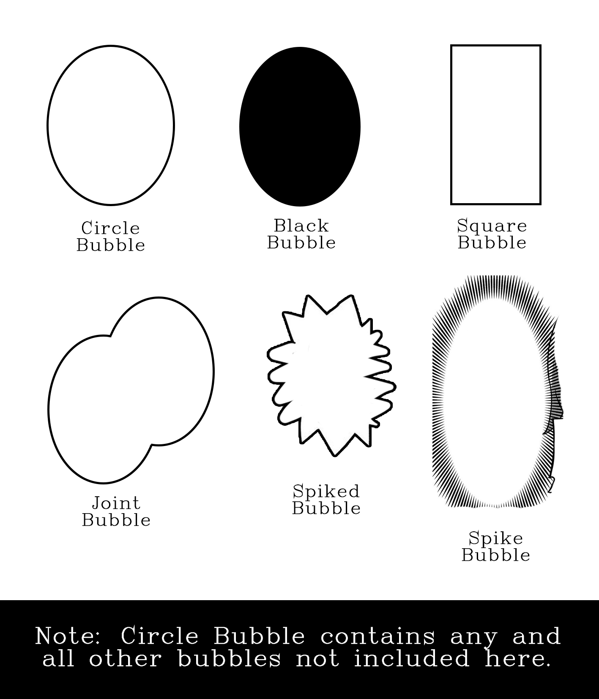

# Comic-Text-Bubble-Detection
Deep Learning model trained using YOLOv11, to detect comic text-bubbles, bubbles, texts etc. It specifically detects bubbles with texts/emojis/contents. Still doesnt support some rare formed bubbles. Trained on 100 custom Labelled Images.

:sunglasses: :sunglasses:


Download the Model from Releases.

Preview - 

## Dataset Info
Images to train were taken from public domains like twitter, pixiv etc. Since Model doesn't recreate any of the artwork I believe it's alright.
Images without empty bubbles were taken i.e. The bubbles with texts were used to train.

There are total of 6 classes.

| Class             | Images | Instances |
|-------------------|--------|-----------|
| All               | 112    | 638       |
| Circle Bubble     | 99     | 408       |
| Black Bubble      | 10     | 28        |
| Joint Bubble      | 38     | 117       |
| Spike Bubble      | 9      | 16        |
| Square Bubble     | 13     | 55        |
| Spiked Bubble     | 5      | 14        |

Since there are very less instances of some classes it doesn't always detect those. But I'm planning to increase the dataset for it's detection.

> classes - circle_bubble black_bubble joint_bubble spike_bubble square_bubble spiked_bubble



## Requirements
Install Yolo Requirements
``` pip install ultralytics opencv-python-headless numpy ```

Install Torch and Torchvision for GPU (I trained with Cuda12.1)
```pip install torch torchvision torchaudio --index-url https://download.pytorch.org/whl/cu121```

## Inference
```
from ultralytics import YOLO

# Load the trained model
model = YOLO(r".\trained\weights\best.pt")

# Run inference on a single image
results = model(r"E:\comic\009_0.jpg", conf=0.3, iou=0.4)
results[0].show() #results[0].to_json() to export the bounding box
```


